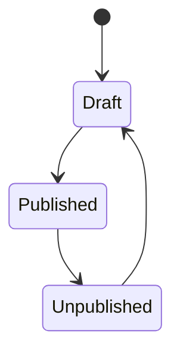

## Structural Constraints

**Product**

- **Attribute constraints**
  - Product name: No more than 200 characters.
  - Product price: Must be an integer greater than 0.
  - Product inventory: Must not be negative (≥ 0).

- **Relationship constraints**
  - None (the current requirements contain no inter-object references).

- **State-machine constraints**
  - States: Draft, Published, Unpublished.
  - Transition path: Draft → Published → Unpublished.
  - An Unpublished product cannot be edited directly; it must first return to Draft.

---

## Behavioral Constraints

- **Precondition validation**
  - Publish a product: The product must be in Draft.
  - Edit a product: The product must be in Draft.
  - Unpublish a product: The product must be Published.

- **Authorization validation**
  - Only administrators may create, edit, publish, or unpublish products.

- **Dependency and mutual-exclusion validation**
  - A product can have only one active state at a time (mutually exclusive).

---

## Derivation Constraints

- None (the current requirements contain no dynamic derivation scenarios).

---

## Resource Constraints

- None (the current requirements contain no system capacity, rate, or quota limits).
