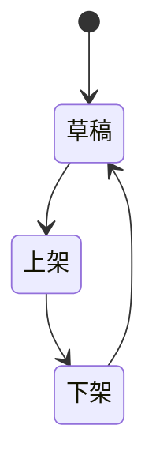

## 结构性约束

**商品对象**

- **字段级约束**
  - 商品名称：不超过 200 字符
  - 商品价格：必须 > 0，且为整数
  - 商品库存：不能为负（≥ 0）

- **关系级约束**
  - 无（当前需求未涉及对象间引用）

- **状态机约束**
  - 状态枚举：草稿、上架、下架
  - 流转路径：草稿 → 上架 → 下架
  - 下架状态不可直接编辑，需先恢复为草稿

---

## 行为性约束

- **前置条件校验**
  - 发布商品：商品状态必须为"草稿"
  - 编辑商品：商品状态必须为"草稿"
  - 下架商品：商品状态必须为"上架"

- **执行权限校验**
  - 仅管理员可执行创建、编辑、发布、下架操作

- **依赖/互斥校验**
  - 同一时间一个商品只能有一个有效状态（互斥）

---

## 推导性约束

- 无（当前需求未涉及动态推导场景）

---

## 资源性约束

- 无（当前需求未涉及系统容量/速率/配额限制）

---
