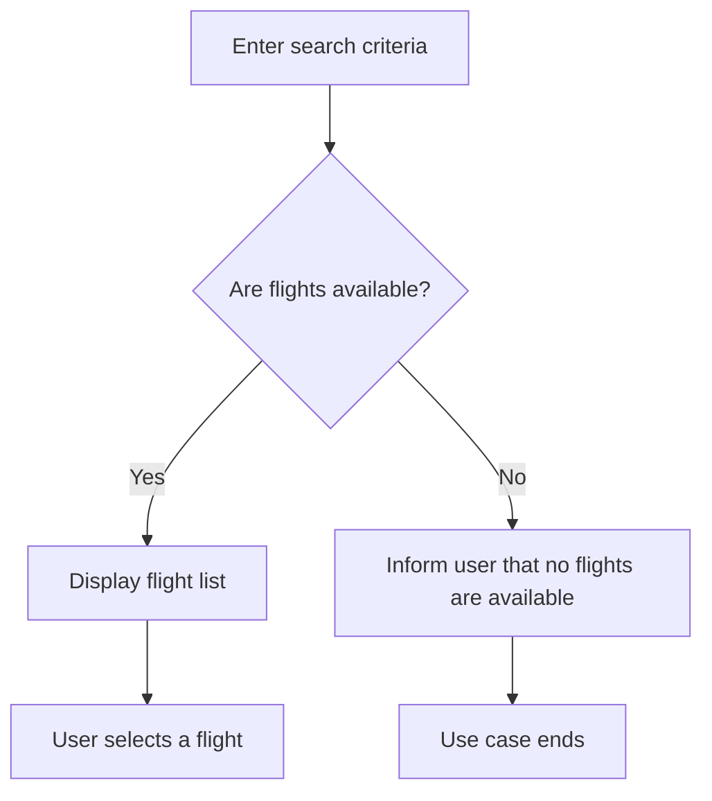

# Use Mermaid to Express Business Workflows in Use-Case Specifications

## Context

Traditional use-case specifications describe workflows in separate textual sections for the basic flow, alternative flows, and exception flows. This approach creates redundant information, makes branching logic difficult to understand, and increases maintenance cost. Introducing Mermaid requires a revised definition of workflow representation and document structure.

## Decision

**Adopt Mermaid as the sole standard for expressing workflows in use-case specifications.**

Core conventions:

1. **Use Mermaid diagrams as the primary workflow representation**
   - Every use-case specification must use a Mermaid flowchart to describe its business workflow.
   - The diagram must completely express the main success scenario, alternative scenarios, and exception scenarios.
   - **Workflow nodes must retain identifiers** (for example, `N1`, `N2`, `N3`, and so on) so that business rules and supplementary descriptions can reference them directly.
   - When a node requires further explanation, reference its identifier in the "Business Rules" section (for example, "N2: When no flight is available, prompt the traveler to change the date").
2. **Remove standalone textual flow sections**
   - Do not separately write "basic flow," "alternative flow," or "exception flow" sections.
3. **Separate the responsibilities of diagrams and rules**
   - **The diagram represents the business workflow**: paths, branches, and transitions.
   - **Text refines the logic**: business rules, constraints, and calculation logic.

## Consequences

- **Positive**: Specifications are more concise, have lower maintenance cost, and are easier to read.
- **Negative**: Team members must become familiar with Mermaid syntax; its learning curve is low.

### Comparison Example

**Traditional approach (redundant):**

```text
Basic flow:
  1. The user enters search criteria.
  2. The system returns a flight list.
  3. The user selects a flight.
  ...

Alternative flow:
  2a. No flights are available.
    - The system informs the user that no flights are available.
    - The use case ends.
```

**New approach (diagram first):**



Business Rules section references:

- **N2**: Display only flights with seats available for sale.
- **N4**: Suggest that the traveler change the date or choose a nearby airport.

## Rejected Alternatives

1. Retain textual flow sections and add a Mermaid diagram → duplicate information and double the maintenance effort.
2. Retain only textual flow sections → branching logic is difficult to read.
