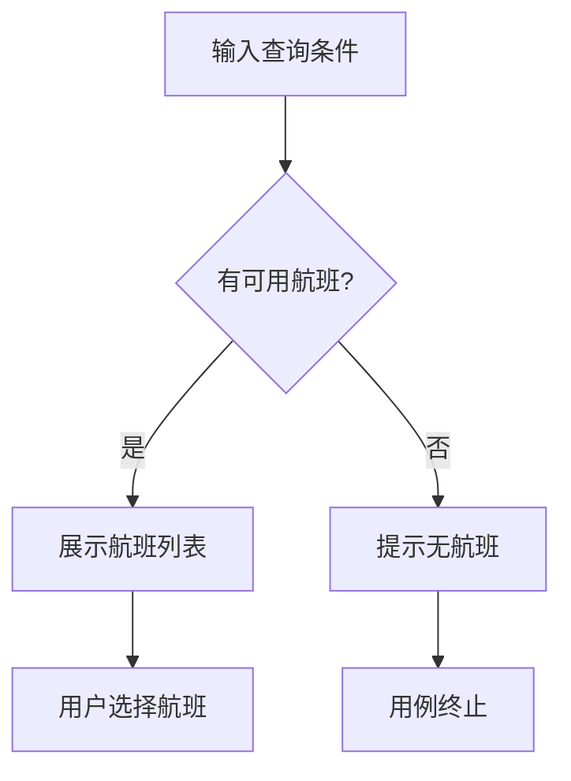

# 用例规约中使用 `mermaid` 表达业务流程

## 上下文

传统用例规约采用"基本事件流 + 备选事件流 + 异常事件流"的文字分章节方式描述业务流程，存在信息冗余、分支逻辑不直观、维护成本高的问题。引入 Mermaid 后，需要重新定义流程表达方式和文档结构。

## 决策

**引入 Mermaid 作为用例规约中流程表达的唯一标准。**

核心约定：

1. **流程表达以 Mermaid 图为核心**
   - 所有用例规约必须使用 `Mermaid` 流程图说明业务流程。
   - 图中需完整表达主成功路径、可选路径、异常路径。
   - **流程节点必须保留编号**（如 `N1`、`N2`、`N3`...），用于在业务规则或补充说明中直接映射引用。
   - 如某节点逻辑需要补充说明，在"业务规则"章节中通过节点编号引用（如"N2：无可用航班时，提示用户调整日期"）。
2. **删除独立的"事件流"文字章节**
   - 不再单独编写"基本事件流""备选事件流""异常事件流"章节。
3. **图与规则的分工**
   - **图负责"业务流程"**：路径、分支、跳转关系。
   - **文字负责"细化逻辑"**：业务规则、约束条件、计算逻辑。

## 后果

- **正面**：文档更简洁，维护成本降低，可读性提升。
- **负面**：团队成员需熟悉 `Mermaid` 语法（学习成本低）。

### 示例对比

**传统方式（冗余）**：

```text
基本事件流：
  1. 用户输入查询条件
  2. 系统返回航班列表
  3. 用户选择航班
  ...

备选事件流：
  2a. 无可用航班
    - 系统提示"无航班"
    - 用例终止
```

**新方式（图为主）**：



业务规则章节引用：

- **N2**：仅展示有可售座位的航班
- **N4**：建议用户调整日期或选择邻近机场

## 替代方案（已否决）

1. 保留文字事件流 + 附加 `Mermaid` 图 → 信息重复，维护双倍工作量。
2. 仅保留文字事件流 → 分支逻辑可读性差。
