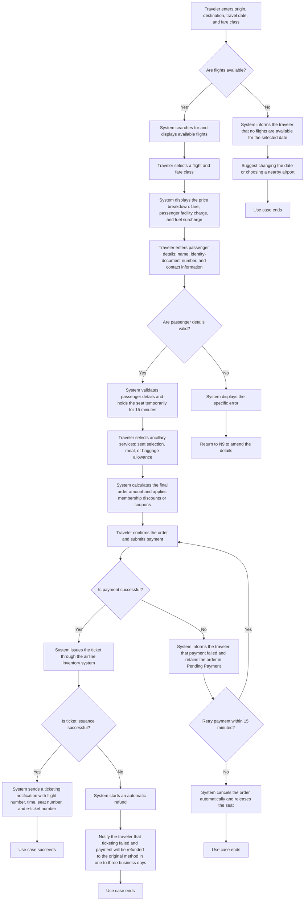

# Book a Flight

## Actors

- **Primary Actor**: Traveler
- **Supporting Actors**: Payment System, Airline Inventory System

## Brief Description

The traveler searches for available flights, selects a flight, enters passenger details, and receives a valid ticket after payment is completed.

## Preconditions

1. The airline inventory system is available.

## Business Workflow

## Postconditions

**Success scenario:**

1. An order number is generated and the order status is "Ticketed".
2. The airline inventory system deducts the corresponding seat inventory.
3. The traveler receives a ticketing notification by SMS or email.
4. The payment system completes the charge.

**Failure scenario:**

1. No order is generated and no seat inventory is deducted.
2. If payment has been collected, a refund to the original payment method is initiated.

## Business Rules

- **Temporary seat-hold period**: The temporary seat hold lasts 15 minutes and is released automatically when it expires (node N11).
- **Payment-timeout rule**: If payment is not completed within 15 minutes, the order is cancelled automatically (node N17).
- **Flight-search restriction**: Display only flights with seats available for sale (node N2).
- **Order-flight restriction**: Every passenger in the same order must select the same flight (node N7).
- **Identity-document purchase limit**: The same identity-document number may purchase only one economy-class ticket on the same flight (node N11).
- **Passenger-information validation**: The name must match the identity-document number, and the identity-document number format must be valid (node N9).
- **Information-change constraint**: Passenger and flight information cannot be changed after the order is submitted (node N16).
- **Child and infant pricing**: A child fare for ages 2–12 is 50% of the adult full fare; an infant fare for children under 2 is 10% (node N8).
- **Promotion-combination restriction**: Membership discounts and coupons cannot be used together (node N15).
- **Special-meal booking**: Special meals, such as vegetarian or halal meals, must be requested at least 24 hours in advance (node N14).

## Special Requirements

- **Performance**: Flight-search response time ≤ 2 seconds; payment-callback processing ≤ 5 seconds.
- **Security**: Encrypt passenger identity-document information at rest; payment processing complies with PCI DSS.
- **Availability**: System availability ≥ 99.9%.

## Extension Points

- N14: Future support for cabin upgrades and lounge reservations.
- N24: Future support for airline-app notifications, WeChat service notifications, and other channels.
